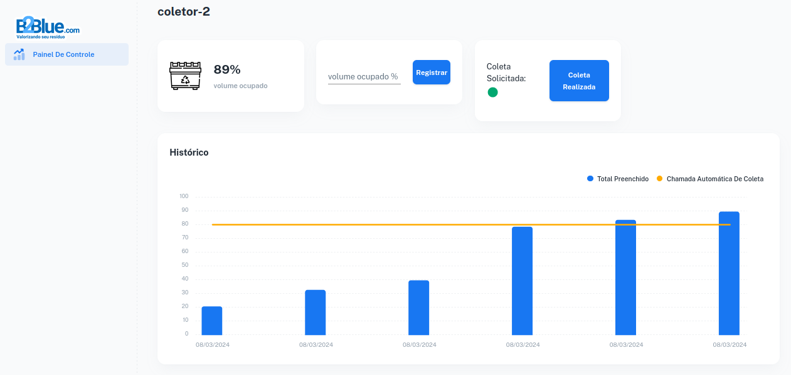

# ecoflow



## Setting up the backend

Use Python 3.10
Run the following commands in the root of the project
```shell
python -m venv .venv
source .venv/bin/activate
pip install -r requirements.txt
python manage.py runserver
```

## Setting up the frontend
In other terminal, run the following commands in ./frontend

Install node 18.0.0
```shell
nvm install 18.0.0
nvm use 18.0.0
```
Install yarn
```shell
npm install --global yarn
```
Install dependencies and run server
```shell
yarn install
yarn dev
```

## Accessing the app
http://localhost:3030/

## Accessing django admin
http://localhost:8000/admin
user: root
pass: abcde
